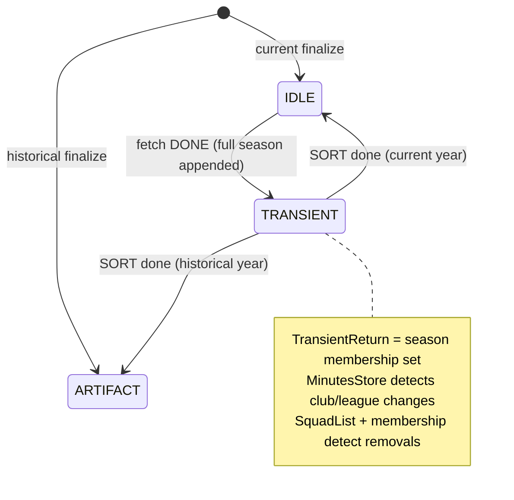

# Squads Workflow Plan (eligibility-3)

Single CRE workflow, multiple handlers. Onchain `RunStatus` + events drive phase transitions; cron only runs the steady-state current-season loop when historical backfill is idle.

**Fully automated:** league/season advance is store-owned (no human, no centralized server, no CRE bookkeeping handler). CRE only fetches SP data and re-enters on events.

Types live in [`types/EligibilityTypes.sol`](./types/EligibilityTypes.sol).

## Goals

- Incrementally backfill **all** `seasonId`s under each new `leagueId`, **one season at a time** (full fetch → full sort → next season).
- After backfill, maintain a **current-season-only** loop with the same per-season discipline.
- Keep CRE HTTP usage only on fetch. SORT is report-only (`SquadPhase`).
- Stay inside CRE registry quotas: **one workflow, many triggers**.
- Handle SP/CRE data risks by default (stay-on-page + within-page cursor; never SORT a partial season).

## Decisions (locked)

| # | Topic | Decision |
|---|---|---|
| 1 | Work unit | **Per `seasonId`**. Never SORT a partial season. Never hold two seasons in `TransientReturn`. |
| 2 | `TransientReturn` | **Full-season staging buffer** (membership set for removal detection). FETCH appends while `seasonId` unchanged; clear only after SORT finalize. |
| 3 | Why paging on FETCH | SP `_pgNm` ≈ one club; CRE ~5KB may **stay-on-page** and drain that club in slices. Advance `_pgNm` only when the club is fully drained. |
| 4 | Within-page cursor | `personsOffset` — idempotent stay-on-page. Retries of an already-accepted slice revert (`FetchOffsetMismatch`). |
| 5 | SORT paging | **Gas only**: upsert → SquadList rebuild → removal pass (`SortPage` carries `step` + `offset`). |
| 6 | Two stores | `MinutesStore` = club/league **changes** on upsert. `SquadList` + buffer membership = **removals** (prior roster ∉ TransientReturn). |
| 7 | Finalize | Auto on last SORT chunk: `TRANSIENT → IDLE\|ARTIFACT`. No `POPULATED`, no `FINALIZE` phase. |
| 8 | Advance wakes | Same season paging → `FetchContinue`. Next season → `SeasonReady`. Next league → `PopulationComplete` (info) + `SeasonsQueued` in the same tx. |
| 9 | Historical vs current | Mutually exclusive via `WorkflowControl`. Shared single-slot buffer requires a mutex. |
| 10 | Phase B wake | Hourly **cron** heartbeat. Optional `LoopPending`. |
| 11 | Entrypoint | Store-owned **`SeasonsQueued(leagueId, …)`** once `RunBook` is updated. |

## Onchain primitives

### `RunStatus` (per `seasonId`)

| Status | Meaning |
|---|---|
| `IDLE` | Waiting for next fetch (current) or not yet started |
| `TRANSIENT` | Full-season `TransientReturn` ready / in SORT |
| `ARTIFACT` | Historical season fully done; never re-run |

### `WorkflowControl` (mutex + active pointer)

| Field | Meaning |
|---|---|
| `pass` | `None` \| `Historical` \| `Current` |
| `historicalActive` | Mirror of `pass == Historical`; cron no-ops when true |
| `activeLeagueId` / `activeLeagueIndex` | League in flight |
| `activeSeasonId` / `activeSeasonIndex` | **Only** season allowed to append/sort right now |
| `currentSeasonStartYear` | Daily-active year for Phase B |

### `TransientReturn` (single slot — full season)

```text
same activeSeasonId:
  FETCH slice (pageFetched, personsOffset) → append; bump personsOffset
  stay-on-page (nextPage == pageFetched) → more slices for same SP club
  club drained (nextPage == pageFetched+1 | DONE) → personsOffset = 0
  … until nextPage == SQUAD_FETCH_PAGE_DONE
  → emit TransientComplete; status TRANSIENT

SORT (full snapshot, gas-chunked):
  step UPSERT:  MinutesStore upsert + SquadList rebuild (stage prior roster)
  step REMOVALS: prior roster ∉ buffer membership → left league
  → IDLE | ARTIFACT; clear TransientReturn; SeasonReady | SeasonsQueued | LoopPending
```

### `SquadPhase` / `SquadReport`

```solidity
enum SquadPhase { FETCH_TRANSIENT, SORT_TRANSIENT }
// SquadReport { phase, leagueId, seasonId, data }  // data = page slice on FETCH only
```

### Events → CRE handlers

| Event | Handler | HTTP? | Role |
|---|---|---|---|
| `SeasonsQueued(leagueId, …)` | `onFetch` | Yes | Start first season of a league |
| `SeasonReady(leagueId, seasonId)` | `onFetch` | Yes | Start next season (page 1 / offset 0) |
| `FetchContinue(…, nextPage, personsOffset)` | `onFetch` | Yes | Resume **same** season (page and/or within-page offset) |
| `TransientComplete(leagueId, seasonId)` | `onSort` | No | Full season staged → SORT |
| `SortPage(…, step, offset)` | `onSortPage` | No | Continue SORT gas chunks |
| `PopulationComplete(leagueId)` | — | — | **Info only.** Next league already woken via `SeasonsQueued` in-tx |
| Cron (hourly) | `onCurrentFetch` (gated) | Yes if gate passes | Phase B current seasons |
| `LoopPending` (optional) | wake / no-op | — | Book terminal |

> **Why no `onLeagueAdvance`?** League advance is already performed onchain in `_idleOrResume` when a league’s last season finalizes. A CRE handler would be a no-op or a race. Automation stays in the store.

---

## Workflow shape (one CRE workflow)

```text
handlers:
  1. EVM Log  → SeasonsQueued                         → onFetch
  2. EVM Log  → SeasonReady                           → onFetch
  3. EVM Log  → FetchContinue                         → onFetch
  4. EVM Log  → TransientComplete                     → onSort
  5. EVM Log  → SortPage                              → onSortPage
  6. Cron     → hourly                                → onCurrentFetch (gated)
  7. EVM Log  → LoopPending (optional)                → onCurrentFetch or no-op
```

Quota cost: **1** public workflow slot.

---

## Phase A — Historical bootstrap

```mermaid
sequenceDiagram
    participant ES as EligibilityStore
    participant CRE as Squads workflow
    participant SP as StatsPerform (relay)

    ES->>ES: RunBook += league; pass = Historical
    ES-->>CRE: SeasonsQueued(leagueId)

    loop each seasonId under leagueId (oldest → newest)
        loop until season fetch DONE
            CRE->>SP: squads _pgNm (≈ one club)
            CRE->>ES: FETCH_TRANSIENT slice (personsOffset)
            ES->>ES: append into TransientReturn
            alt club not drained / more pages
                ES-->>CRE: FetchContinue(nextPage, personsOffset)
            else fetch DONE
                ES->>ES: season → TRANSIENT
                ES-->>CRE: TransientComplete(leagueId, seasonId)
            end
        end

        loop until SortCursor done
            CRE->>ES: SORT_TRANSIENT
            alt upsert chunk
                ES->>ES: MinutesStore + SquadList rebuild
                ES-->>CRE: SortPage(UPSERT, offset)
            else removals chunk
                ES->>ES: prior roster ∉ buffer → left league
                ES-->>CRE: SortPage(REMOVALS, offset)
            else sort DONE
                ES->>ES: IDLE or ARTIFACT; clear buffer
            end
        end

        alt more seasons in league
            ES-->>CRE: SeasonReady(nextSeasonId)
        else league done
            ES-->>CRE: PopulationComplete(leagueId)
            alt more leagues queued
                ES-->>CRE: SeasonsQueued(nextLeagueId)
            else book terminal
                ES->>ES: pass = None
                ES-->>CRE: LoopPending
            end
        end
    end
```

### Finalize rule (per season, end of SORT)

- `seasonStartYear == currentSeasonStartYear` → `IDLE`
- else → `ARTIFACT`

### Cron gate (Phase B)

```text
cron fires
  → if pass != None / historicalActive → no-op
  → else → start current-season pass (still one seasonId at a time)
```

---

## Phase B — Recurring current-season loop

Same per-season pipeline as Phase A, only seasons with  
`seasonStartYear == currentSeasonStartYear`:

1. Cron + `nextCurrentSeason()` gate → FETCH (stay-on-page / `FetchContinue` as needed).
2. `TransientComplete` → SORT (upsert + removals) → `IDLE`.
3. `SeasonReady` for next current season; when done → `pass = None`; wait for cron.



---

## SORT semantics (two stores)

| Store | Role |
|---|---|
| `MinutesStore.currentClubId` / `currentLeagueId` | Upsert overwrite → **transfer / league move** signal |
| `SquadList` + TransientReturn membership | Prior roster player **not** in buffer → **removal** (retirement, death, unsupported league, etc.) |

Intra-league club moves appear as “left old squad” candidates but are present in the buffer under the new club → not removed.

---

## Still open (non-blocking)

1. Phase B player filter: `active == yes` only vs all `status == active` (affects CRE packaging, not the state machine).
2. Who sets `currentSeasonStartYear` (store admin vs CRE config).
3. Verifier handoff of `_pendingLeftLeague` → TransferLocker.

---

## Implementation order

1. ~~Land updated `EligibilityTypes.sol`~~
2. ~~Store: `_processReport` FETCH (offset cursor) + SORT (upsert/removals) + onchain advance~~
3. CRE multi-handler workflow (`SeasonReady` + `FetchContinue` + sort triggers).
4. Port SP fetch (`_pgSz=1` club pages, stay-on-page slices) into `onFetch`.
5. Phase B cron + mutex; sequential current seasons.
6. Verifier + TransferLocker drain of pending leavers.
7. Simulate each handler; deploy as the single public squads workflow.
