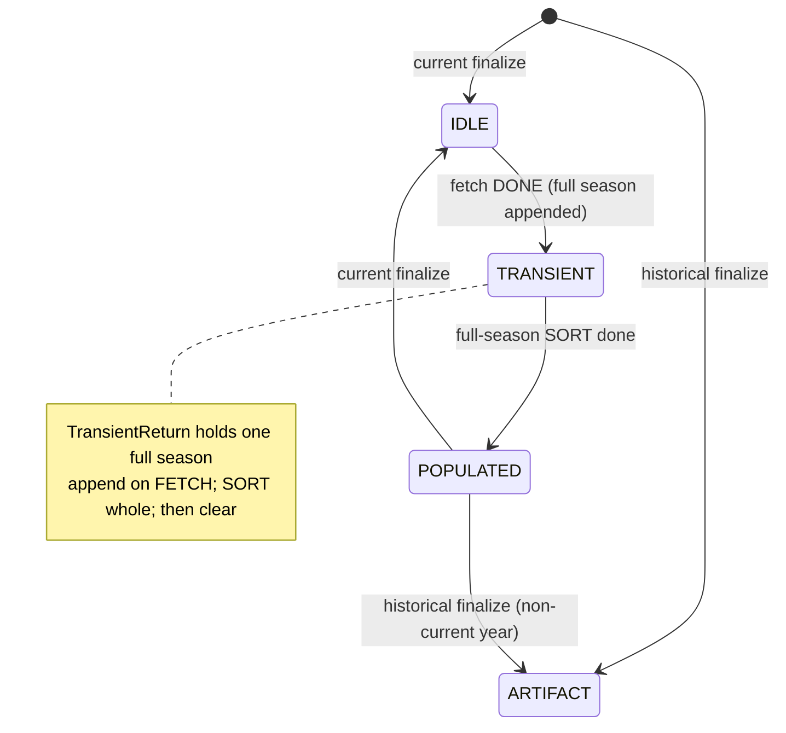

# Squads Workflow Plan (eligibility-3)

Single CRE workflow, multiple handlers. Onchain `RunStatus` + events drive phase transitions; cron only runs the steady-state current-season loop when historical backfill is idle.

Types live in [`EligibilityTypes.sol`](./EligibilityTypes.sol). Compare against preliminary [`eligibility-2/types/EligibilityTypes.sol`](../eligibility-2/types/EligibilityTypes.sol).

## Goals

- Incrementally backfill **all** `seasonId`s under each new `leagueId`, **one season at a time** (full fetch → full sort → next season).
- After backfill, maintain a **current-season-only** loop with the same per-season discipline.
- Keep CRE HTTP usage only on fetch. Sort / finalize are report-only (`SquadPhase`).
- Stay inside CRE registry quotas: **one workflow, many triggers**.

## Decisions (locked)

| # | Topic | Decision |
|---|---|---|
| 1 | Work unit | **Per `seasonId`**. Never SORT a partial season. Never hold two seasons in `TransientReturn`. |
| 2 | `TransientReturn` | **Full-season staging buffer**. FETCH pages **append** while `seasonId` is unchanged; **overwrite/clear** only when advancing to the next season after sort. |
| 3 | Why paging on FETCH | CRE report (~5KB) + HTTP caps — not because SORT is per-page logically. SP squads dumps are large (e.g. PL ~20 clubs / ~881 players). |
| 4 | SORT paging | **Gas only**: `SortPage` re-emits while draining the full-season buffer into `MinutesStore` / `SquadList` (needed for coherent club/league transfer detection). |
| 5 | Complete events | **`TransientComplete(leagueId, seasonId)`** is season-scoped. **`PopulationComplete(leagueId)`** fires when every season under that league is finalized (`IDLE`\|`ARTIFACT`). |
| 6 | League order | Process leagues sequentially; within a league, seasons oldest→newest, each fully completed before the next. |
| 7 | Historical vs current | **Mutually exclusive** via `WorkflowControl` (`PassKind` / `historicalActive`). Shared single-slot buffer requires a mutex. |
| 8 | Phase B wake | Hourly **cron** heartbeat. Optional `LoopPending`. |
| 9 | Entrypoint | Store-owned **`SeasonsQueued(leagueId, …)`** once `RunBook` is updated. |

## Onchain primitives

### `RunStatus` (per `seasonId`)

| Status | Meaning |
|---|---|
| `IDLE` | Current-season season; waiting for next recurring run |
| `TRANSIENT` | **Full-season** `TransientReturn` ready (fetch `DONE`); awaiting / in SORT |
| `POPULATED` | Sort of that season complete; awaiting finalize |
| `ARTIFACT` | Historical season fully done; never re-run |

### `WorkflowControl` (mutex + active pointer)

| Field | Meaning |
|---|---|
| `pass` | `None` \| `Historical` \| `Current` |
| `historicalActive` | Mirror of `pass == Historical`; cron no-ops when true |
| `activeLeagueId` / `activeLeagueIndex` | League in flight |
| `activeSeasonId` / `activeSeasonIndex` | **Only** season allowed to append/sort right now |
| `currentSeasonStartYear` | Daily-active year for Phase B |

### `TransientReturn` (single slot — full season)

```text
same activeSeasonId:
  FETCH page → append parallel arrays; bump pageFetched/nextPage
  … until nextPage == SQUAD_FETCH_PAGE_DONE
  → emit TransientComplete(leagueId, seasonId); status TRANSIENT

SORT (full snapshot, gas-chunked via SortPage):
  upsert → MinutesStore / SquadList (transfer-aware)
  → POPULATED → FINALIZE (IDLE or ARTIFACT)
  → clear TransientReturn

next seasonId:
  overwrite/reset buffer; repeat
```

### `SquadPhase` / `SquadReport`

```solidity
enum SquadPhase { FETCH_TRANSIENT, SORT_TRANSIENT, FINALIZE }
// SquadReport { phase, leagueId, seasonId, data }  // data = page slice on FETCH only
```

### Events → CRE handlers

| Event | Handler | HTTP? | Role |
|---|---|---|---|
| `SeasonsQueued(leagueId, …)` | `onFetch` | Yes | Start first season (or resume league) |
| `FetchContinue(leagueId, seasonId, nextPage)` | `onFetch` | Yes | Append more pages into **same** season buffer |
| `TransientComplete(leagueId, seasonId)` | `onSort` | No | Full season staged → begin SORT |
| `SortPage(leagueId, seasonId, offset)` | `onSortPage` | No | Continue SORT gas chunks |
| `PopulationComplete(leagueId)` | `onLeagueAdvance` / finalize bookkeeping | No | All seasons in league done → next league or clear pass |
| Cron (hourly) | `onCurrentFetch` (gated) | Yes if gate passes | Phase B current seasons, still **one season at a time** |
| `LoopPending` (optional) | wake | — | Book terminal |

---

## Workflow shape (one CRE workflow)

```text
handlers:
  1. EVM Log  → SeasonsQueued                         → onFetch
  2. EVM Log  → FetchContinue                         → onFetch
  3. EVM Log  → TransientComplete                     → onSort
  4. EVM Log  → SortPage                              → onSortPage
  5. EVM Log  → PopulationComplete                    → onLeagueAdvance
  6. Cron     → hourly                                → onCurrentFetch (gated)
  7. EVM Log  → LoopPending (optional)                → onCurrentFetch or no-op
```

Quota cost: **1** public workflow slot.

---

## Phase A — Historical bootstrap (per season, then per league)

```mermaid
sequenceDiagram
    participant ES as EligibilityStore
    participant CRE as Squads workflow
    participant SP as StatsPerform (relay)

    ES->>ES: RunBook += league; pass = Historical
    ES-->>CRE: SeasonsQueued(leagueId)

    loop each seasonId under leagueId (oldest → newest)
        loop until season fetch DONE
            CRE->>SP: squads page
            CRE->>ES: FETCH_TRANSIENT page slice
            ES->>ES: append into TransientReturn
            alt more pages / HTTP budget
                ES-->>CRE: FetchContinue(seasonId, nextPage)
            else fetch DONE
                ES->>ES: season → TRANSIENT
                ES-->>CRE: TransientComplete(leagueId, seasonId)
            end
        end

        loop until SortCursor done
            CRE->>ES: SORT_TRANSIENT
            ES->>ES: upsert full snapshot chunk
            alt more sort gas
                ES-->>CRE: SortPage(...)
            else sort DONE
                ES->>ES: season → POPULATED
            end
        end

        CRE->>ES: FINALIZE (or store auto-finalize)
        alt seasonStartYear == currentSeasonStartYear
            ES->>ES: season → IDLE
        else historical
            ES->>ES: season → ARTIFACT
        end
        ES->>ES: clear TransientReturn; advance activeSeasonIndex
    end

    ES-->>CRE: PopulationComplete(leagueId)
    alt more leagues queued
        ES-->>CRE: SeasonsQueued(nextLeagueId)
    else book terminal
        ES->>ES: pass = None; historicalActive = false
        ES-->>CRE: LoopPending (optional)
    end
```

### Finalize rule (per season, after its SORT)

- `seasonStartYear == currentSeasonStartYear` → `IDLE`
- else → `ARTIFACT`

### Cron gate (Phase B)

```text
cron fires
  → if historicalActive / pass != None     → no-op
  → if any season not in {IDLE, ARTIFACT} → no-op
  → else → start current-season pass (still one seasonId at a time)
```

---

## Phase B — Recurring current-season loop

Same **per-season** pipeline as Phase A, but only seasons with  
`seasonStartYear == currentSeasonStartYear`:

1. Pick next current `seasonId` → FETCH pages **append** → `FetchContinue` as needed.
2. `TransientComplete(seasonId)` → SORT full buffer (`SortPage` for gas) → transfer-aware upserts.
3. Finalize → `IDLE` (never `ARTIFACT` on this path); clear buffer; next current season.
4. When all current seasons done → `pass = None`; wait for next cron.



---

## Diff vs eligibility-2 preliminary types

| Area | eligibility-2 | eligibility-3 |
|---|---|---|
| Season book | `RunNumber` + jagged arrays | `RunBook` + `SeasonRun`; active league **and season** indices |
| Pass mutex | (none) | `PassKind`, `historicalActive`, active pointers |
| Transient buffer | implied page object | **Full-season append buffer**; overwrite only on season change |
| CRE phase | (none) | `SquadPhase`, `SquadReport` (page slice on FETCH) |
| Fetch continue | (none) | `FetchContinue` (HTTP budget across executions) |
| Sort paging | (none) | `SortCursor` + `SortPage` (gas over full season) |
| Complete events | (none) | Season-scoped `TransientComplete`; league-scoped `PopulationComplete` |
| Bucket enum | `EligibilityTypes` | `EligibilityBucket` |

---

## Still open (non-blocking)

1. Exact membership / transfer rules on SORT (overwrite `SquadList`, soft-discontinue leavers, league moves) — port from existing squad-fill recurring path.
2. Who sets `currentSeasonStartYear` (store admin vs CRE config).
3. Whether `FINALIZE` is a separate CRE handler after each season SORT, or auto-applied onchain at end of last `SortPage`.

---

## Implementation order

1. Land updated `EligibilityTypes.sol` (append semantics, season pointers, events).
2. Store: `WorkflowControl`, single `TransientReturn` append/clear, `_processReport` by `SquadPhase`.
3. CRE multi-handler workflow (`FetchContinue` + season-scoped sort triggers).
4. Port SP fetch + naming into `onFetch` (append-only until DONE).
5. Full-season SORT + transfer logic with `SortPage`.
6. Phase B cron + mutex; sequential current seasons.
7. Simulate each handler; deploy as the single public squads workflow.
